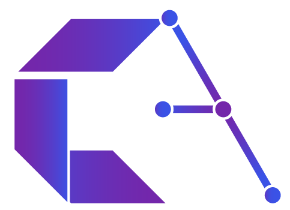
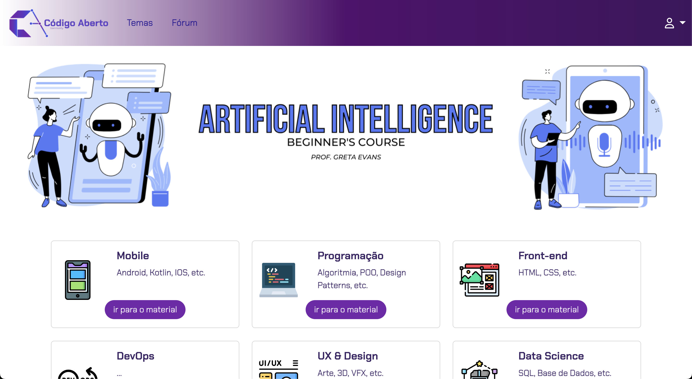
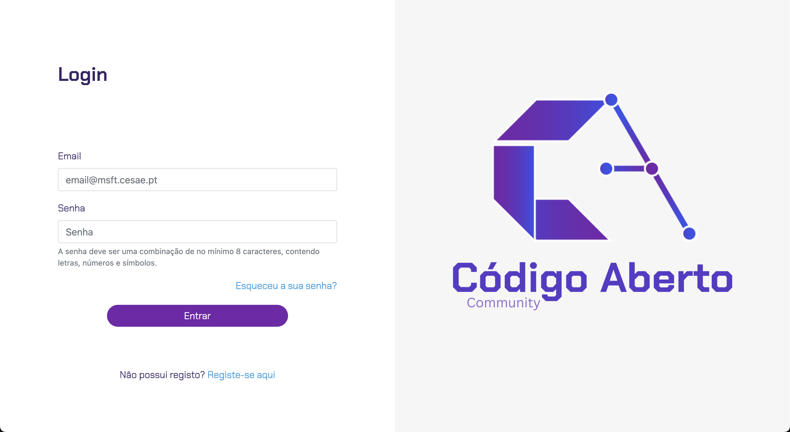

# Código Aberto Community



## Overview

Código Aberto (Open Source) is a knowledge-sharing community platform developed using Laravel. This project was created as a final assignment for the Laravel course at Cesae Digital school.

The platform provides a space for users to share and access educational content across various technology domains including:

-   Mobile Development (Android, Kotlin, iOS)
-   Programming (Algorithms, OOP, Design Patterns)
-   Front-end Development (HTML, CSS)
-   DevOps
-   UX & Design (Art, 3D, VFX)
-   Data Science (SQL, Databases)

## Screenshots

### Home Page


_The home page showcases the Artificial Intelligence Beginner's Course and various technology categories users can explore._

### Login Page


_The login page with email/password authentication and registration options._

## Features

-   User authentication and registration
-   Course browsing by category
-   Forum for community discussions
-   Topic-based content organization
-   Responsive design for desktop and mobile users

## Technologies Used

-   **Laravel** - PHP framework for full-stack web development
-   **MySQL** - Database management
-   **Bootstrap** - Frontend styling and components
-   **JavaScript** - Interactive elements

## Installation

1. Clone the repository:

```bash
git clone https://github.com/paulanberto/projeto-final-cesae-alunos.git CesaeAlunos
cd CesaeAlunos
```

2. Install dependencies:

```bash
composer install
npm install
```

3. Set up environment:

```bash
cp .env.example .env
php artisan key:generate
```

4. Configure database in `.env` file:

```
DB_CONNECTION=mysql
DB_HOST=127.0.0.1
DB_PORT=3306
DB_DATABASE=CesaeAlunos
DB_USERNAME=root
DB_PASSWORD=
```

5. Run migrations and seeders:

```bash
php artisan migrate --seed
```

6. Start the development server:

```bash
php artisan serve
```

## Usage

After installation, visit `http://localhost:8000` in your browser to access the application.

## Credits

This project was developed as part of the Laravel course at Cesae Digital by:

-   [Paula Berto](https://github.com/paulanberto)
-   [Guilherme Carasek](https://github.com/Guilherme-Carasek)
-   [Bruno Balmant](https://github.com/BrunoBalmant)
-   [Filipe Costa](https://github.com/gitumbelino)

## License

This project is licensed under the [MIT License](LICENSE.md).
